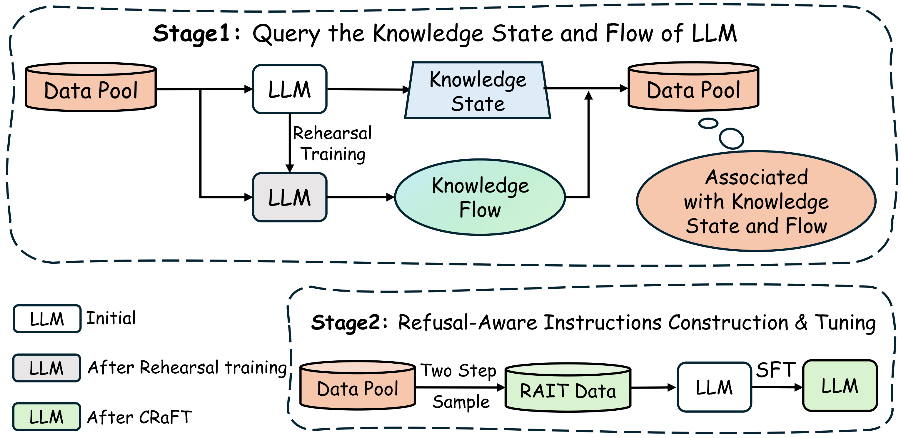

# Utilize the Flow before Stepping into the Same River Twice: Certainty Represented Knowledge Flow for Refusal-Aware Instruction Tuning

[](https://arxiv.org/abs/2410.06913)

[[Project Page](https://zrc007.github.io/CRaFT_page/)] [[Paper](https://arxiv.org/abs/2410.06913)]

[English](README.md) | 简体中文

# CRaFT: Certainty Represented Knowledge Flow for Refusal-Aware Instruction Tuning

## Introduction

拒绝感知指令调优（RAIT）使大语言模型（LLMs）能够拒绝回答无法确定的问题。通过将训练数据中对未知问题的回答修改为类似“我不知道”的拒绝回答，RAIT 提高了 LLMs 的可靠性并减少了它们的幻觉现象。通常，RAIT 会根据初始 LLM 回答的正确性来修改训练样本。然而，这种方法可能导致 LLMs 拒绝那些它们本可以正确回答的问题，我们称这种问题为**过度拒绝**。为了解决这一问题，我们提出了 Certainty Represented Knowledge Flow for Refusal-Aware Instructions Tuning (**CRaFT**)。CRaFT 的框架如下所示。

<div align="center">
  
</div>

## Getting Start

### Preparing enviroment and data

我们的代码采用了[xtuner](https://github.com/InternLM/xtuner.git)和[opencompass](https://github.com/Zrc007/opencompass_CRaFT.git)进行训练和评测，所以我们需要先安装对应代码。

```bash
## xtuner
git clone https://github.com/InternLM/xtuner.git
cd xtuner
conda create --name xtuner-env python=3.10 -y
conda activate xtuner-env
pip install -e '.[all]'

## opencompass
git clone https://github.com/Zrc007/opencompass_CRaFT.git
cd opencompass
conda create --name opencompass python=3.10 -y
conda activate opencompass
pip install -e .
```

我们分别在 OEQA 和 MCQA 上进行了实验。对于 OEQA，我们使用了 TriviaQA 作为训练集，TriviaQA 和 NQ 作为测试集。对于 MCQA，我们使用 MMLU 作为训练集，ARC 作为测试集。我们已经对这四个数据集进行了预处理，并将其存储在路径`dataset\preprocessed_dataset`下。

### CRaFT

CRaFT 支持 OEQA 和 MCQA。OEQA 的处理流程如下（MCQA 的执行顺序也是一致的）:

- Stage1: Query Knowledge State and Flow

  ```bash
  export HF_HOME = your_HF_HOME_path
  ## get knowledge state (correctness and certainty) of initial model
  (opencompass) ./scripts/stage1/OEQA/triviaqa_kq_init.sh

  ## rehearsal train and get knowledge flow

  ### construct rehearsal training instructions
  (opencompass) ./scripts/stage1/OEQA/triviaqa_rehearsal_instructions_construction.sh

  ### rehearsal train(You can also train using other training frameworks and then add the model to `compass_config/models`)
  (xtuner-env) ./scripts/stage1/OEQA/triviaqa_rehearsal_SFT.sh
  (xtuner-env) ./scripts/stage1/OEQA/triviaqa_rehearsal_convert.sh

  ### get knowledge flow
  (opencompass) ./scripts/stage1/OEQA/triviaqa_kq_rehearsal.sh
  ```

- Stage2: Refusal-Aware instructions construction & Tuning

  ```bash
  ## Refusal-Aware instructions construction
  (opencompass) ./scripts/stage2/OEQA/triviaqa_instructions_construction.sh

  ## Refusal-Aware instructions Tuning
  (xtuner-env) ./scripts/stage2/OEQA/triviaqa_CRaFT.sh
  (xtuner-env) ./scripts/stage2/OEQA/triviaqa_CRaFT_convert.sh
  ```

## Evaluation

```bash
## OEQA
(opencompass) ./scripts/Eval/OEQA/triviaqa_eval.sh
(opencompass) ./scripts/Eval/OEQA/nq_eval.sh

## MCQA
(opencompass) ./scripts/Eval/MCQA/mmlu_eval.sh
(opencompass) ./scripts/Eval/MCQA/ARC_c_Test_eval.sh
```

## Citation

```
@article{zhu2024utilize,
  title={Utilize the Flow before Stepping into the Same River Twice: Certainty Represented Knowledge Flow for Refusal-Aware Instruction Tuning},
  author={Zhu, Runchuan and Ma, Zhipeng and Wu, Jiang and Gao, Junyuan and Wang, Jiaqi and Lin, Dahua and He, Conghui},
  journal={arXiv preprint arXiv:2410.06913},
  year={2024}
}
```
